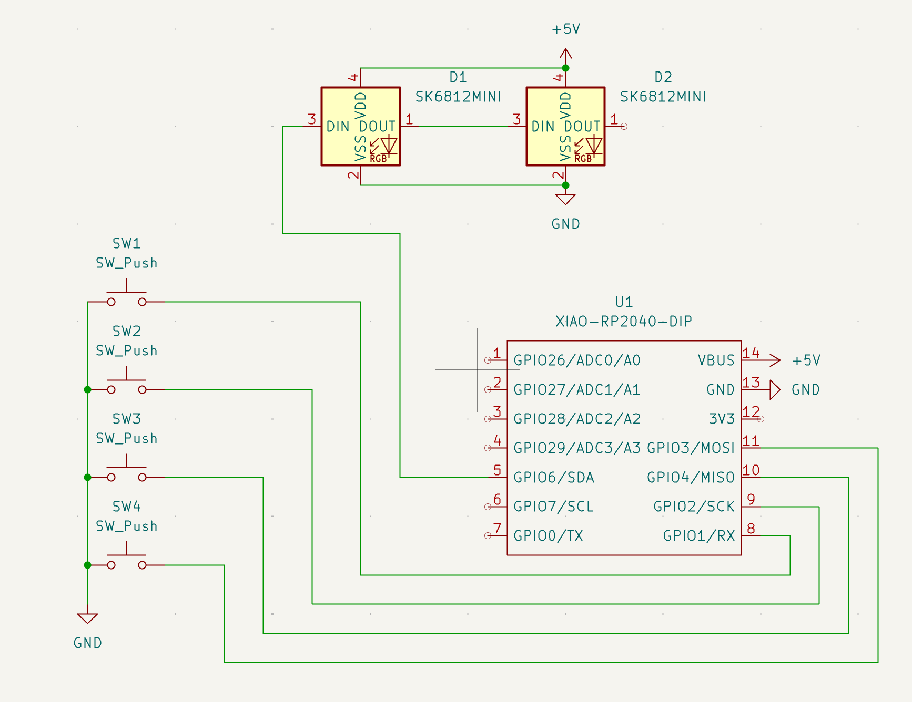
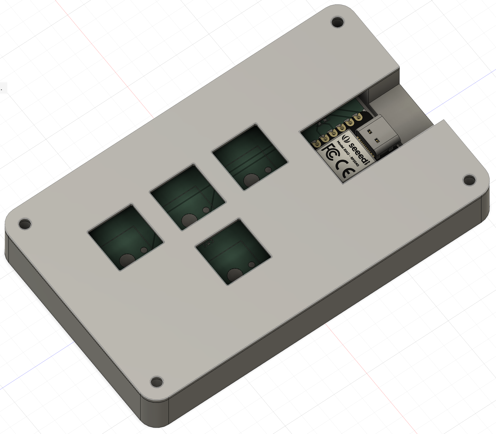
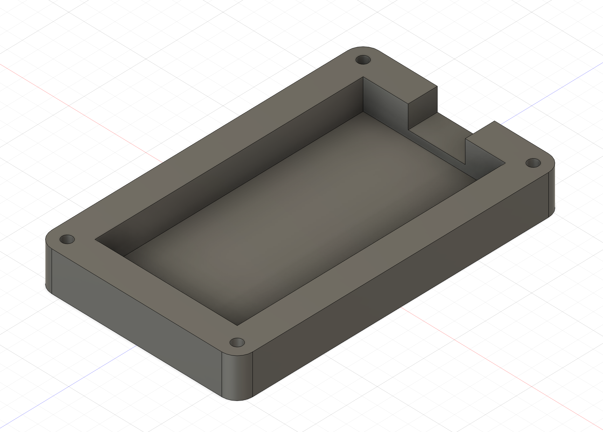

# CamoKid's Hackpad
This is a macropad that I plan to use for gaming. I followed the Hackpad guide on [Blueprint](https://blueprint.hackclub.com/), but customised the key layout to be similar to arrow keys, rather than in a square layout.

The project can be viewed at this link:
[https://blueprint.hackclub.com/projects/2541](https://blueprint.hackclub.com/projects/2541)

## Components
This project features the following components:
* XIAO-RP2040-DIP microcontroller
* 4 push switches
* 2 SK6812 MINI LEDs
* 3D printed case

## Schematic

The schematic was designed on KiCad, and used the OPL KiCad library for the microcontroller. It includes a XIAO-RP2040-DIP microcontroller, 4 push switches, and 2 SK6812 MINI LEDs.

## PCB

The PCB was also designed in KiCad. I added some customisation on the silkscreen, by adding a title and the link to this repository. The renders for the XIAO RP2040 and SK6812 MINI LEDs are also included in the above images.

## Case

The case was designed in Fusion. It has spaces for the 4 switches and a USB-A male slot. THe STEP files include the top and bottom case.

